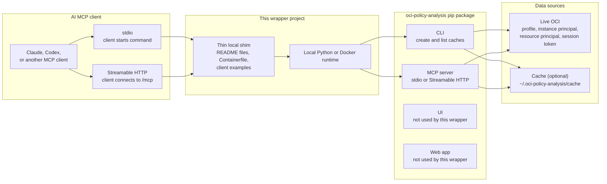

# OCI Identity Policy MCP Server

## Overview

This server is a zero-code wrapper for the MCP server provided by the
`oci-policy-analysis` Python package. It packages the upstream entry point,
container runtime defaults, and client setup examples for OCI IAM policy and
identity analysis.

MCP is flexible. The same server can be started in several ways:

- as a local Python process managed by an MCP client over `stdio`
- as a standalone Streamable HTTP endpoint
- from a local Python environment installed with `pip` or `uv`
- from Docker or Rancher Desktop
- from live OCI data or a previously created local cache
- with profile, instance principal, resource principal, session token, or cache
  data loading

Client-specific setup examples extend this page:

- [Claude Desktop setup](README-CLAUDE.md)
- [Codex setup](README-CODEX.md)

## Architecture

The upstream `oci-policy-analysis` pip package contains multiple entry points.
This wrapper uses the CLI and MCP server paths only. The upstream UI and web app
remain available from the upstream package, but they are not required for this
MCP wrapper.



## Quick Start Choices

Use cached `stdio` when testing a desktop MCP client for the first time. It is
fast, repeatable, and does not call OCI APIs during client startup.

Use Streamable HTTP when the MCP server should run independently from the
client, such as on a server, in a container, or behind a controlled network
endpoint.

Use live mode when you want the server to load directly from OCI. Live mode can
also write a cache after the load so later client starts can use cached mode.

## Install With Pip Or UV

This wrapper targets Python 3.13+. The shell examples use `python` for
readability. If your shell exposes Python as `python3`, use `python3` instead.
For MCP client config files, use the absolute Python executable path.

The MCP implementation comes from `oci-policy-analysis[mcp]`. The base package
includes the CLI used to create and list caches; the `mcp` extra adds the MCP
server dependencies.

Using `pip` with the upstream package:

```sh
python3.13 -m venv .venv
source .venv/bin/activate
python -m pip install --upgrade pip
python -m pip install --upgrade "oci-policy-analysis[mcp,cli]"
```

Using `uv` with the upstream package:

```sh
uv venv --python 3.13
source .venv/bin/activate
uv pip install "oci-policy-analysis[mcp,cli]"
```

If you cloned this wrapper repository and want the wrapper package, script, and
locked dependency set:

```sh
uv sync
uv run oracle.oci-identity-policy-mcp-server --help
```

Verify the CLI and MCP entry points:

```sh
python -m oci_policy_analysis.cli --help
python -m oci_policy_analysis.mcp_server --help
```

Inside this repository, you can also use:

```sh
uv run python -m oci_policy_analysis.mcp_server --help
```

The examples use `python -m oci_policy_analysis.mcp_server` because it works
consistently with virtual environments, `pip`, and `uv`. If you install this
wrapper package, the `oracle.oci-identity-policy-mcp-server` console script
starts the same MCP server entry point.

Use `oci-policy-analysis[web]` for the upstream web application, or
`oci-policy-analysis[all]` when you intentionally want every optional upstream
extra.

## Package Source Options

Use the published package name, version, and extras from any pip-accessible
source:

```sh
python -m pip install "<your-package-name>[<extras>]==<your-version>"
```

For private indexes, set pip index environment variables before install:

```sh
export PIP_INDEX_URL=<private-index-url>
export PIP_EXTRA_INDEX_URL=<fallback-index-url>
```

## Executable Paths For MCP Clients

MCP clients start the configured command directly. They usually do not activate
your shell profile, expand aliases, expand `$HOME`, or activate a virtual
environment first.

Find the Python executable that has `oci-policy-analysis` installed:

```sh
python -c "import sys; print(sys.executable)"
```

From a project virtual environment without activating it:

```sh
./.venv/bin/python -c "import sys; print(sys.executable)"
```

Use the printed path as `<PYTHON_EXECUTABLE>` in Claude or Codex config.

Find Docker:

```sh
command -v docker
```

If Docker is provided by Rancher Desktop, the executable may not be on the MCP
client's inherited `PATH`. Rancher Desktop commonly provides Docker at:

```text
$HOME/.rd/bin/docker
```

Confirm it is available:

```sh
$HOME/.rd/bin/docker --version
```

Use the absolute path, for example `/Users/<you>/.rd/bin/docker`, as
`<DOCKER_EXECUTABLE>` in client config.

## Parameters

The local Python MCP entry point uses command-line arguments. The Docker image
entrypoint converts `MCP_*` environment variables into those arguments.

### Data And Auth Mode

Exactly one of these data/auth modes is required for the Python MCP server.

| Python argument | Docker environment | Use when |
|---|---|---|
| `--profile <OCI_PROFILE>` | `MCP_AUTH_MODE=profile`, `OCI_PROFILE=<OCI_PROFILE>` | Load live data with an OCI CLI config profile. |
| `--use-cache <CACHE_NAME>` | `MCP_AUTH_MODE=cache`, `MCP_CACHE_NAME=<CACHE_NAME>` | Load from a local cache without calling OCI APIs. |
| `--instance-principal` | `MCP_AUTH_MODE=instance_principal` | Load live data from an OCI instance principal. |
| `--resource-principal` | `MCP_AUTH_MODE=resource_principal` | Load live data from an OCI resource principal, such as a Container Instance. |
| `--session-token <SESSION_TOKEN_PROFILE>` | `MCP_AUTH_MODE=session_token`, `OCI_SESSION_TOKEN=<SESSION_TOKEN_PROFILE>` | Load live data with an OCI session-token profile. |

### Runtime Arguments

| Python argument | Docker environment | Default | Notes |
|---|---|---:|---|
| `--transport stdio` or `--transport streamable-http` | `MCP_TRANSPORT` | Python: `stdio`; Docker: `streamable-http` | `stdio` is client-managed. Streamable HTTP runs an endpoint at `/mcp`. |
| `--host <HOST>` | `MCP_HOST` | Python: `127.0.0.1`; Docker: `0.0.0.0` | Only used with Streamable HTTP. Use network controls before exposing beyond localhost. |
| `--port <PORT>` | `MCP_PORT` | `8765` | Streamable HTTP port. |
| `--log-level <LEVEL>` | `MCP_LOG_LEVEL` | Python: `WARNING`; Docker: `INFO` | `CRITICAL`, `ERROR`, `WARNING`, `INFO`, or `DEBUG`. |
| `--compartment-domain-search-depth <1-6>` | `MCP_COMPARTMENT_DOMAIN_SEARCH_DEPTH` | Python: `1`; Docker: `2` | Controls identity-domain compartment traversal depth. |
| `--recursive` | Always enabled by current parser default | enabled | Recursively loads compartments. |
| `--dont-save-cache-after-load` | `MCP_SAVE_CACHE_AFTER_LOAD=false` | cache write enabled | Disables cache writeback after a live load. |

For `stdio` clients, also set:

```text
MCP_STDIO_MODE=1
PYTHONUNBUFFERED=1
PYTHONWARNINGS=ignore
```

These keep server output predictable for MCP clients that communicate over
standard input and output.

## Python Versus Docker

Use Python arguments for local Python:

```sh
python -m oci_policy_analysis.mcp_server \
  --use-cache <CACHE_NAME> \
  --transport stdio
```

Use environment variables for Docker:

```sh
docker run --rm -i \
  -v "$HOME/.oci-policy-analysis/cache:/app/.oci-policy-analysis/cache:ro" \
  -e MCP_AUTH_MODE=cache \
  -e MCP_CACHE_NAME=<CACHE_NAME> \
  -e MCP_TRANSPORT=stdio \
  oracle.oci-identity-policy-mcp-server:latest
```

If you append arguments after the Docker image and the first appended argument
starts with `--`, the entrypoint bypasses `MCP_*` translation and runs
`python3.13 -m oci_policy_analysis.mcp_server` with exactly those arguments.
Include every required server argument explicitly when using that style.

## Streamable HTTP

The Streamable HTTP MCP URL is:

```text
http://127.0.0.1:8765/mcp
```

The server also exposes:

```text
http://127.0.0.1:8765/health
```

For local clients, use `127.0.0.1` even when the Docker container binds to
`0.0.0.0` inside the container. On a server, bind only to a protected interface
or put the endpoint behind trusted network controls. Do not expose the MCP
endpoint directly to the public internet.

## Create And Use A Cache

Use this workflow when you do not want Claude or Codex to start the MCP server in
live mode. The CLI performs one live OCI load, saves a local cache, and the MCP
client later starts the server in cached mode.

Create or refresh a cache using an OCI CLI profile:

```sh
python -m oci_policy_analysis.cli \
  --profile DEFAULT \
  --recursive
```

The CLI saves a combined cache by default after a live load. Do not add
`--dont-save-cache-after-load` when your goal is to create a cache.

List available cache entries for a tenancy name:

```sh
python -m oci_policy_analysis.cli --get-caches <TENANCY_NAME>
```

The listed entries are the cache names to use with MCP clients. They look like:

```text
<TENANCY_NAME>_2026-06-11-18-30-00-UTC
```

Use that full entry as `<CACHE_NAME>`:

- Local Python MCP: pass `--use-cache <CACHE_NAME>`.
- Docker MCP: set `MCP_AUTH_MODE=cache` and `MCP_CACHE_NAME=<CACHE_NAME>`.
- Claude: replace `<CACHE_NAME>` in [README-CLAUDE.md](README-CLAUDE.md).
- Codex: replace `<CACHE_NAME>` in [README-CODEX.md](README-CODEX.md).

Cache files are normally stored under:

```text
$HOME/.oci-policy-analysis/cache
```

For Docker cached mode, mount the local cache directory so the container can read
the cache created by the CLI:

```sh
-v "$HOME/.oci-policy-analysis/cache:/app/.oci-policy-analysis/cache:ro"
```

If a cache file is named:

```text
combined_cache_<CACHE_NAME>.json
```

use only `<CACHE_NAME>` for `--use-cache` or `MCP_CACHE_NAME`.

## MCP Tools

Once loaded, the MCP server exposes tools for policy filtering, identity lookup,
cross-tenancy policy inspection, and live reload. Large result sets return
summaries; narrower filters return full records.

| Tool | Purpose |
|---|---|
| `filter_policy_statements` | Primary policy statement search. Filters by action, verb, resource, policy name, compartment path, effective path, location, subject type, subject, principal keys, structured principals, exact users/groups/dynamic groups, fuzzy user/group/dynamic group searches, permission, comments, conditions, validity, and statement text. |
| `search_users` | Search users by domain, name/display-name text, or OCID. |
| `search_groups` | Search groups by domain, group name, or group OCID. |
| `search_dynamic_groups` | Search dynamic groups by domain, name, OCID, matching rule text, or in-use status. |
| `get_groups_for_user` | Return group memberships for an exact user. |
| `get_users_for_group` | Return users in an exact group. |
| `cross-tenancy-alias-list` | List cross-tenancy alias definitions loaded from policy data. |
| `cross-tenancy-policies-by-alias` | Return cross-tenancy policy statements that reference an alias. |
| `reload_mcp_data` | Reload live OCI data without restarting the server. This is available only when the server was started with live auth, not cache mode. |

Some clients normalize hyphenated tool names to underscores in their UI. The
tool descriptions shown by the client are the source of truth for the exact
callable name in that client.

## Example Index

| Example | Runtime | Transport | Data mode |
|---|---|---|---|
| [Create and list a cache](#example-create-and-list-a-cache) | Python CLI | n/a | live profile to local cache |
| [Local Python cached stdio](#example-local-python-cached-stdio) | Python | `stdio` | cache |
| [Local Python live Streamable HTTP](#example-local-python-live-streamable-http) | Python | `streamable-http` | live profile |
| [Docker cached stdio](#example-docker-cached-stdio) | Docker | `stdio` | cache |
| [Docker cached Streamable HTTP](#example-docker-cached-streamable-http) | Docker | `streamable-http` | cache |
| [Docker live profile Streamable HTTP](#example-docker-live-profile-streamable-http) | Docker | `streamable-http` | live profile |
| [OCI resource principal Streamable HTTP](#example-oci-resource-principal-streamable-http) | Docker or OCI runtime | `streamable-http` | resource principal |

Claude and Codex have additional client config examples:

- [Claude Desktop example index](README-CLAUDE.md#example-index)
- [Codex example index](README-CODEX.md#example-index)

## Examples

### Example: Create And List A Cache

```sh
python -m oci_policy_analysis.cli \
  --profile DEFAULT \
  --recursive
```

```sh
python -m oci_policy_analysis.cli --get-caches <TENANCY_NAME>
```

### Example: Local Python Cached Stdio

Use this when an MCP client owns the server process lifecycle.

```sh
MCP_STDIO_MODE=1 PYTHONUNBUFFERED=1 PYTHONWARNINGS=ignore \
python -m oci_policy_analysis.mcp_server \
  --use-cache <CACHE_NAME> \
  --transport stdio \
  --log-level ERROR
```

### Example: Local Python Live Streamable HTTP

Use this when you want a local standalone endpoint that loads from an OCI CLI
profile.

```sh
python -m oci_policy_analysis.mcp_server \
  --profile DEFAULT \
  --transport streamable-http \
  --host 127.0.0.1 \
  --port 8765 \
  --log-level INFO \
  --compartment-domain-search-depth 2
```

Connect the MCP client to:

```text
http://127.0.0.1:8765/mcp
```

### Example: Docker Cached Stdio

Use `-i` for MCP stdio. Do not use `-t`, `--tty`, or `--it`.

```sh
docker run --rm -i \
  -v "$HOME/.oci-policy-analysis/cache:/app/.oci-policy-analysis/cache:ro" \
  -e MCP_AUTH_MODE=cache \
  -e MCP_CACHE_NAME=<CACHE_NAME> \
  -e MCP_TRANSPORT=stdio \
  -e MCP_LOG_LEVEL=ERROR \
  -e MCP_STDIO_MODE=1 \
  -e MCP_SAVE_CACHE_AFTER_LOAD=false \
  -e PYTHONUNBUFFERED=1 \
  -e PYTHONWARNINGS=ignore \
  oracle.oci-identity-policy-mcp-server:latest
```

### Example: Docker Cached Streamable HTTP

```sh
docker run --rm -p 127.0.0.1:8765:8765 \
  -v "$HOME/.oci-policy-analysis/cache:/app/.oci-policy-analysis/cache:ro" \
  -e MCP_AUTH_MODE=cache \
  -e MCP_CACHE_NAME=<CACHE_NAME> \
  -e MCP_TRANSPORT=streamable-http \
  -e MCP_HOST=0.0.0.0 \
  -e MCP_PORT=8765 \
  -e MCP_LOG_LEVEL=INFO \
  -e MCP_SAVE_CACHE_AFTER_LOAD=false \
  oracle.oci-identity-policy-mcp-server:latest
```

Connect the MCP client to:

```text
http://127.0.0.1:8765/mcp
```

### Example: Docker Live Profile Streamable HTTP

The mounted `$HOME/.oci` directory must include the OCI config file and private
key files referenced by the selected profile.

```sh
docker run --rm -p 127.0.0.1:8765:8765 \
  -v "$HOME/.oci:/app/.oci:ro" \
  -v "$HOME/.oci-policy-analysis/cache:/app/.oci-policy-analysis/cache" \
  -e MCP_AUTH_MODE=profile \
  -e OCI_PROFILE=DEFAULT \
  -e MCP_TRANSPORT=streamable-http \
  -e MCP_HOST=0.0.0.0 \
  -e MCP_PORT=8765 \
  -e MCP_LOG_LEVEL=INFO \
  -e MCP_COMPARTMENT_DOMAIN_SEARCH_DEPTH=2 \
  oracle.oci-identity-policy-mcp-server:latest
```

### Example: OCI Resource Principal Streamable HTTP

This mode is intended for OCI runtimes such as Container Instances where
resource principal authentication is available.

```sh
docker run --rm -p 8765:8765 \
  -v mcp-policy-cache:/app/.oci-policy-analysis/cache \
  -e MCP_AUTH_MODE=resource_principal \
  -e MCP_TRANSPORT=streamable-http \
  -e MCP_HOST=0.0.0.0 \
  -e MCP_PORT=8765 \
  -e MCP_LOG_LEVEL=INFO \
  -e MCP_COMPARTMENT_DOMAIN_SEARCH_DEPTH=2 \
  oracle.oci-identity-policy-mcp-server:latest
```

On a server, prefer a private listener, private subnet, SSH tunnel, reverse
proxy, or other access control appropriate for the environment.

## Build Container Image

Build the image with the default package, `oci-policy-analysis[mcp]`:

```sh
docker build -f Containerfile -t oracle.oci-identity-policy-mcp-server:latest .
```

Build the image with a specific package name or version:

```sh
docker build -f Containerfile \
  --build-arg OPA_PIP_PACKAGE=<your-package-name> \
  --build-arg OPA_PIP_EXTRAS=<extras-or-empty> \
  --build-arg OPA_PIP_VERSION=<your-version> \
  -t oracle.oci-identity-policy-mcp-server:latest .
```

Quick dependency sanity check:

```sh
docker run --rm oracle.oci-identity-policy-mcp-server:latest \
  python3.13 -c "import fastmcp; print('fastmcp ok')"
```

## Container Notes

- Without a mounted cache directory, container cache data is ephemeral.
- Mount cache read-only for cached test runs.
- Mount cache read-write for live runs when you want new cache files written.
- The package writes logs under `/app/.oci-policy-analysis/logs` inside the
  container.

## Contributing

This server is intentionally designed to avoid local MCP tool implementation
code.

Typical contribution flow:

1. Publish or update the upstream Python package.
2. Update this server's documented package version and usage examples.
3. Validate cached local `stdio` startup.
4. Validate cached container `stdio` startup.
5. Validate `streamable-http` startup when changing HTTP or container behavior.
6. Submit the PR with focused docs, package, or container updates.

## Third-Party APIs

Developers choosing to distribute a binary implementation of this project are
responsible for obtaining and providing all required licenses and copyright
notices for the third-party code used in order to ensure compliance with their
respective open source licenses.

## Disclaimer

Users are responsible for their local environment and credential safety.
Different language model selections may yield different results and performance.

## License

Copyright (c) 2026 Oracle and/or its affiliates.

Released under the Universal Permissive License v1.0 as shown at
<https://oss.oracle.com/licenses/upl/>.
